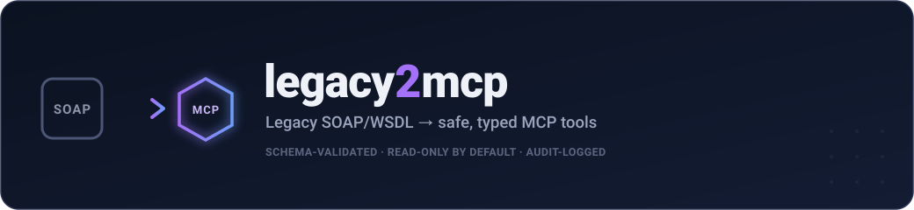
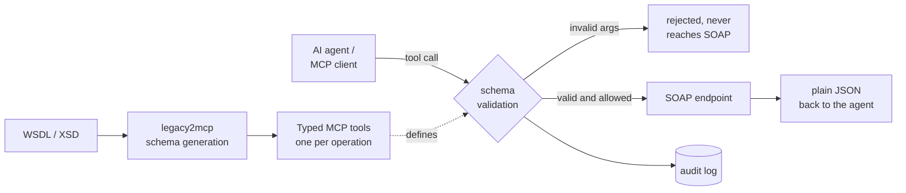

<!-- mcp-name: io.github.bvenkata/legacy2mcp -->

<div align="center">



<p>
  <a href="https://github.com/bvenkata/legacy2mcp/actions/workflows/ci.yml"></a>
  <a href="https://pypi.org/project/legacy2mcp/"></a>
  <a href="https://pypi.org/project/legacy2mcp/"></a>
  <a href="https://registry.modelcontextprotocol.io/v0.1/servers?search=io.github.bvenkata/legacy2mcp"></a>
  <a href="https://glama.ai/mcp/servers/bvenkata/legacy2mcp"></a>
  <a href="LICENSE"></a>
</p>

<p><b>Point it at a WSDL. Get an MCP server whose tools can't drift from the service, can't send unvalidated arguments, and can't call write operations you didn't opt into.</b></p>


</div>

---

> [!NOTE]
> `legacy2mcp` introspects every operation in a WSDL, builds a real JSON Schema for each one **from the WSDL's own XSD types**, and exposes them as [MCP](https://modelcontextprotocol.io/) tools — with **every call schema-validated before it reaches your SOAP endpoint**, **write-like operations excluded by default**, and **every call audit-logged**. No hand-written adapter code, no hand-maintained schemas.

## Contents

- [Install](#install)
- [Quick start](#quick-start)
- [How it works](#how-it-works)
- [Point it at your own WSDL](#point-it-at-your-own-wsdl)
- [Use it from Claude Desktop](#use-it-from-claude-desktop-or-any-mcp-client)
- [What's handled](#whats-handled)
- [Safety model](#safety-model)
- [Use cases](#use-cases)
- [Real-world usage](#real-world-usage)
- [Configuration reference](#configuration-reference)
- [Roadmap](#roadmap)
- [Development](#development) · [Contributing](#contributing) · [License](#license)

## Install

```bash
pip install legacy2mcp
# or:  uv tool install legacy2mcp   ·   pipx install legacy2mcp
```

Also published to the **[MCP Registry](https://registry.modelcontextprotocol.io/v0.1/servers?search=io.github.bvenkata/legacy2mcp)** as `io.github.bvenkata/legacy2mcp`, so registry-aware MCP clients can discover it directly.

## Quick start

Try it end-to-end against the bundled mock SOAP service — no external network, no real backend:

```bash
git clone https://github.com/bvenkata/legacy2mcp.git
cd legacy2mcp
pip install -e ".[dev]"

# 1. start the demo SOAP service (dneonline-style Calculator WSDL)
python examples/soap/run_mock_calculator.py &

# 2. see the MCP tools generated from its WSDL
legacy2mcp inspect --config examples/soap/config.calculator.yaml
```

<details>
<summary>Or with Docker</summary>

```bash
docker compose up demo-soap-service -d
docker compose run --rm legacy2mcp legacy2mcp inspect \
  --config examples/soap/config.calculator.docker.yaml
```
</details>

## How it works



1. Loads the WSDL with [`zeep`](https://docs.python-zeep.org/), a mature, widely-used Python SOAP client.
2. For every operation on every port/binding, converts the XSD input type into a JSON Schema ([`schema/xsd_to_jsonschema.py`](src/legacy2mcp/schema/xsd_to_jsonschema.py)) — simple types, nested complex types, enums and arrays, recursively, depth-limited for pathological WSDLs.
3. Registers one MCP tool per operation, named `<adapter_id>_<OperationName>`.
4. On a tool call: validates arguments with `jsonschema` (schemas use `additionalProperties: false`), calls the operation via `zeep`, serializes the response to plain JSON, and writes an audit entry.
5. Operations whose names look like writes are excluded unless `allow_write_operations: true`.

## Point it at your own WSDL

```yaml
# config.yaml
server:
  name: my-legacy-mcp

adapters:
  - id: legacy
    type: soap
    config:
      wsdl_url: "https://service.example.com/LegacyService?wsdl"
      auth:
        type: basic
        username: "svc-account"
        password_env: "SERVICE_PASSWORD"   # value read from the environment, never the file
      allow_write_operations: false        # Create*/Update*/Delete*/… stay hidden
      include_operations: ["GetRecord", "GetRecordDetails", "SearchRecords"]

security:
  audit:
    enabled: true
    path: "./legacy-mcp-audit.log"
```

```bash
export SERVICE_PASSWORD=...
legacy2mcp inspect --config config.yaml   # review the generated tools
legacy2mcp run     --config config.yaml   # start the MCP server (stdio)
```

A production-shaped template with comments lives at [`examples/soap/config.template.yaml`](examples/soap/config.template.yaml).

## Use it from Claude Desktop (or any MCP client)

```json
{
  "mcpServers": {
    "legacy": {
      "command": "legacy2mcp",
      "args": ["run", "--config", "/absolute/path/to/config.yaml"]
    }
  }
}
```

## What's handled

| Area | Covered |
|---|---|
| **Type mapping** | `string` / `int` / `long` / `decimal` / `boolean` / `date` / `dateTime` / `base64Binary` / … → JSON Schema types + formats |
| **Structure** | nested complex types, repeated elements → arrays, `xsd:enumeration` → `enum`, recursion depth-limited |
| **Discovery** | every service → port → binding → operation; duplicate tool names rejected at startup |
| **Invocation** | argument validation, `zeep` call, response serialized to plain JSON, single-field responses re-wrapped to a named result |
| **Errors** | SOAP faults and transport errors caught and returned as clean messages — no stack traces to the caller |
| **Auth** | HTTP basic (username + `*_env` password); anonymous |
| **Transport** | `stdio` (the transport Claude Desktop and most agent frameworks spawn) |

See [docs/security.md](docs/security.md) for the full, honest security model — what's covered today and what isn't yet.

## Safety model

| Layer | What it does |
|---|---|
| **Schema validation** | No arguments reach the SOAP layer without passing `jsonschema.validate` against that operation's generated schema. |
| **Read-only by default** | Operation names are matched against write-verb prefixes (`Create`, `Update`, `Delete`, `Cancel`, `Void`, `Submit`, `Pay`, …); those tools aren't exposed unless you set `allow_write_operations: true`. |
| **Explicit allow / deny** | `include_operations` (allowlist) and `exclude_operations` (denylist) on top of the heuristic. |
| **Audit log** | One JSON line per call — tool, arguments, timestamp, outcome, duration. |
| **Secret hygiene** | Credentials come from named environment variables; the YAML stays safe to commit. |

> [!WARNING]
> The write-operation filter is a **name heuristic, not semantic analysis** — an operation called `ProcessRecord` that deletes data would not be caught. For any system where a wrong call has real consequences, set `include_operations` explicitly and don't rely on the heuristic. There is also no auth/authz on the MCP server itself yet — don't expose a v0.1 server to untrusted callers. Details in [docs/security.md](docs/security.md).

## Use cases

| Domain | Shape |
|---|---|
| **Systems of record** | An agent reads status/detail records from a legacy back-office platform, read-only, every lookup logged. |
| **Financial services** | Expose account and transaction *reads* without exposing transfers or adjustments. |
| **Supply chain / ERP** | Surface order status, inventory, shipment tracking from an old SOAP middleware layer. |
| **Internal support tooling** | A support copilot gets safe, typed access to the system of record instead of a scraped UI. |
| **Migration & modernization** | Put an MCP layer in front of a legacy service now; swap the backend later without touching the agent. |

## Real-world usage

### In CI/CD — catch WSDL drift before it reaches production

`legacy2mcp inspect` loads the config, contacts the WSDL, builds every schema, and exits non-zero if anything fails:

```yaml
- name: Check the WSDL still generates valid MCP tools
  env:
    SERVICE_PASSWORD: ${{ secrets.SERVICE_PASSWORD }}
  run: |
    pip install legacy2mcp
    legacy2mcp inspect --config config/legacy.yaml > tools.json
    git diff --exit-code --no-index tools/legacy.snapshot.json tools.json  # optional: pin the contract
```

### As a sidecar / long-running MCP server

`legacy2mcp run` speaks MCP over stdio. Package it with your config using the provided [`Dockerfile`](Dockerfile) and let your MCP client launch it.

### In a data pipeline

Call the same generated, validated tools from your own code via any MCP client library to pull records on a schedule — the audit log records exactly what was fetched.

## Configuration reference

| Key | Default | Meaning |
|---|---|---|
| `server.name` | `legacy2mcp` | MCP server name reported to clients |
| `server.transport` | `stdio` | only `stdio` is implemented in v0.1 |
| `adapters[].id` | — | prefix for this adapter's tool names |
| `adapters[].type` | — | `soap` (implemented); `db` / `queue` are on the roadmap |
| `adapters[].config.wsdl_url` | — | WSDL location (`http(s)://…?wsdl` or a file path) |
| `adapters[].config.auth` | `{type: none}` | `none` or `{type: basic, username, password_env}` |
| `adapters[].config.allow_write_operations` | `false` | expose write-like operations |
| `adapters[].config.include_operations` | all | allowlist of operation names |
| `adapters[].config.exclude_operations` | `[]` | denylist of operation names |
| `adapters[].config.timeout_seconds` | `15` | per-call SOAP timeout |
| `security.audit.enabled` | `true` | write the audit log |
| `security.audit.path` | `./legacy2mcp-audit.log` | audit log location |

## Roadmap

| Version | Scope | Status |
|---|---|---|
| **v0.1** | SOAP/WSDL adapter, schema generation, validation, read-only default, audit log, `run` + `inspect` CLI, basic auth, stdio | ✅ shipped |
| v0.2 | Database adapter (parameterized-query-only, table/operation allowlists), HTTP/SSE transport, role→tool authorization, OAuth2 for SOAP | planned |
| v0.3+ | Queue adapter (Kafka/RabbitMQ/SQS), workflow composition with approval gates, OpenTelemetry export | ideas |

Full detail in [docs/roadmap.md](docs/roadmap.md). The [`BaseAdapter`](src/legacy2mcp/adapters/base.py) interface (`discover_tools()` + `invoke()`) is the extension point — the server core handles validation, dispatch and audit for any adapter.

## Development

```bash
pip install -e ".[dev]"
pytest tests/ -v          # runs against an in-process mock SOAP service — no network
```

CI runs the suite on Python 3.10–3.12 ([`ci.yml`](.github/workflows/ci.yml)). Releases to PyPI and the MCP Registry are tag-triggered — see [docs/releasing.md](docs/releasing.md). The demo GIF is regenerated with `vhs demo/demo.tape` ([`demo/`](demo/)).

## Contributing

Adapters for new legacy systems are the highest-value contribution — implement `BaseAdapter` and the core handles the rest. Issues and PRs welcome.

## License

[Apache 2.0](LICENSE)

<div align="center"><sub>legacy2mcp · <a href="https://github.com/bvenkata/legacy2mcp">github.com/bvenkata/legacy2mcp</a></sub></div>
